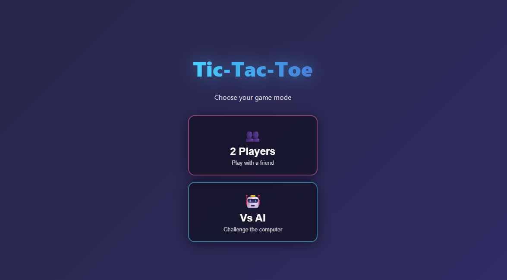

# 🎮 Ultimate Tic-Tac-Toe



> A premium, futuristic take on the classic game, built with **React** and featuring an unbeatable AI.

## ✨ Features

- **🤖 Advanced AI**: Challenge yourself against a Minimax-powered AI with three difficulty levels:
  - **Easy**: Perfect for beginners (Random moves).
  - **Medium**: A balanced challenge (Mix of optimal and random).
  - **Hard**: Unbeatable! (Uses Minimax algorithm).
- **👥 Two Player Mode**: Play locally with a friend.
- **🎨 Glassmorphism UI**: A stunning, modern interface with neon glows, backdrop blurs, and smooth animations.
- **⚡ Responsive Design**: optimized for both desktop and mobile devices.
- **🔄 Interactive Animations**: Engaging cell pop-ins, winning line strikes, and hover effects.

## 🛠️ Tech Stack

- **React 18**: For a robust and efficient component-based architecture.
- **CSS3**: Custom keyframe animations, gradients, and Flexbox/Grid layouts.
- **Vercel**: Seamless deployment and hosting.

## 🚀 Getting Started

Follow these steps to run the game locally on your machine.

### Prerequisites

Make sure you have [Node.js](https://nodejs.org/) installed.

### Installation

1.  **Clone the repository**
    ```bash
    git clone https://github.com/naitik09090/Tic-Tac-Toe.git
    cd Tic-Tac-Toe
    ```

2.  **Install dependencies**
    ```bash
    npm install
    ```

3.  **Run the game**
    ```bash
    npm run dev
    ```
    Open [http://localhost:3000](http://localhost:3000) to view it in the browser.

## 📸 Screenshots

| Start Screen |
|:---:|
|  | 

| Gameplay |
|:---:|
|  |

## 🤝 Contributing

Contributions are welcome! Feel free to open issues or submit pull requests.

1.  Fork the Project
2.  Create your Feature Branch (`git checkout -b feature/AmazingFeature`)
3.  Commit your Changes (`git commit -m 'Add some AmazingFeature'`)
4.  Push to the Branch (`git push origin feature/AmazingFeature`)
5.  Open a Pull Request

## 📄 License

Distributed under the MIT License. See `LICENSE` for more information.

---

<div align="center">
  <sub>Built with ❤️ by <a href="https://github.com/naitik09090">Naitik</a></sub>
</div>
